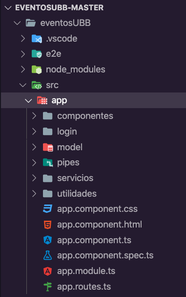
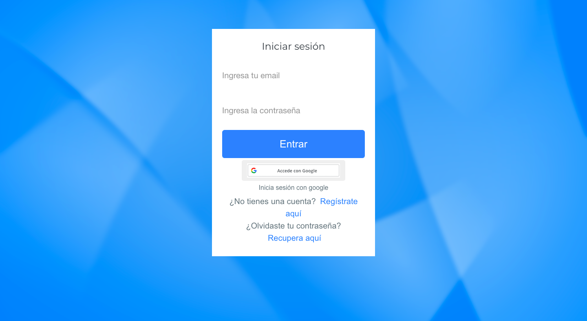
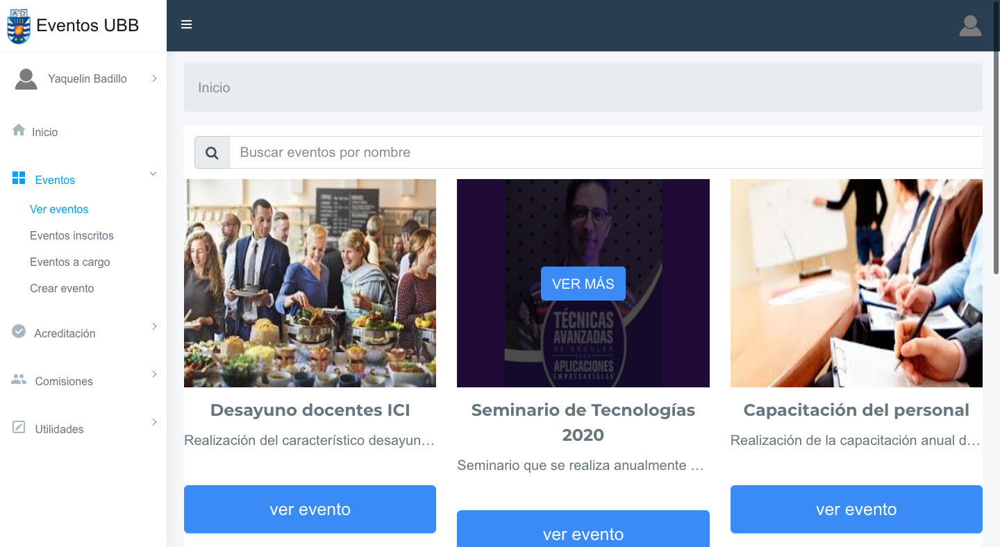
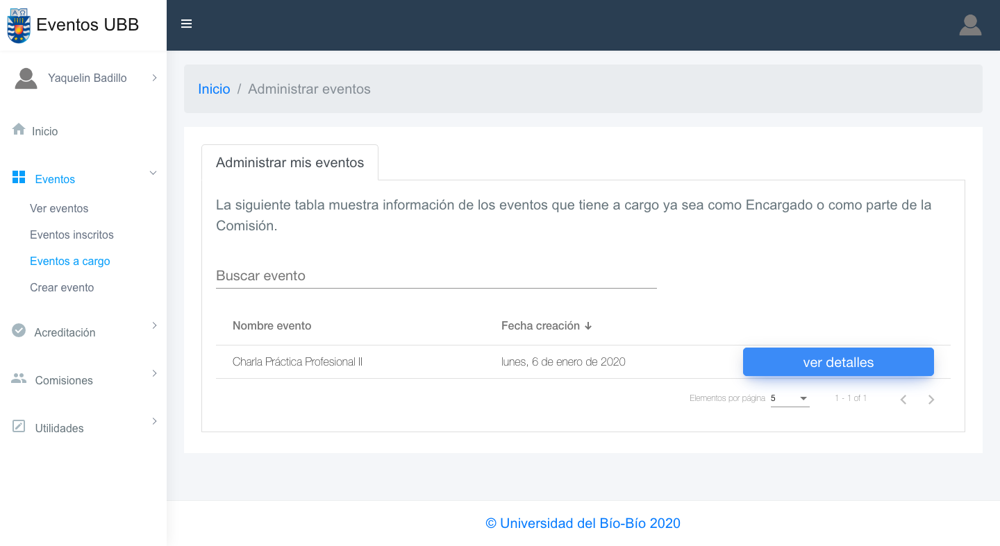
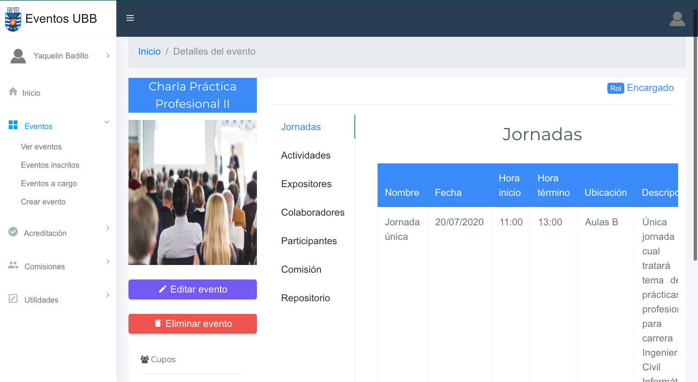
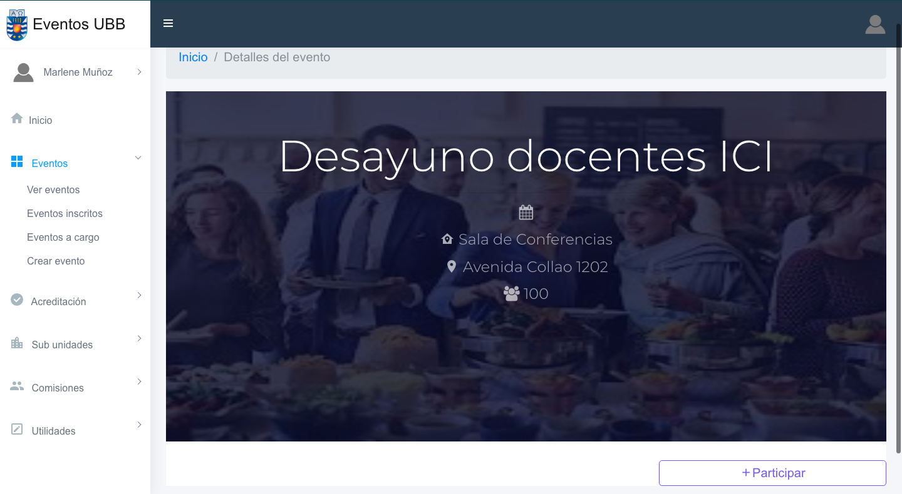
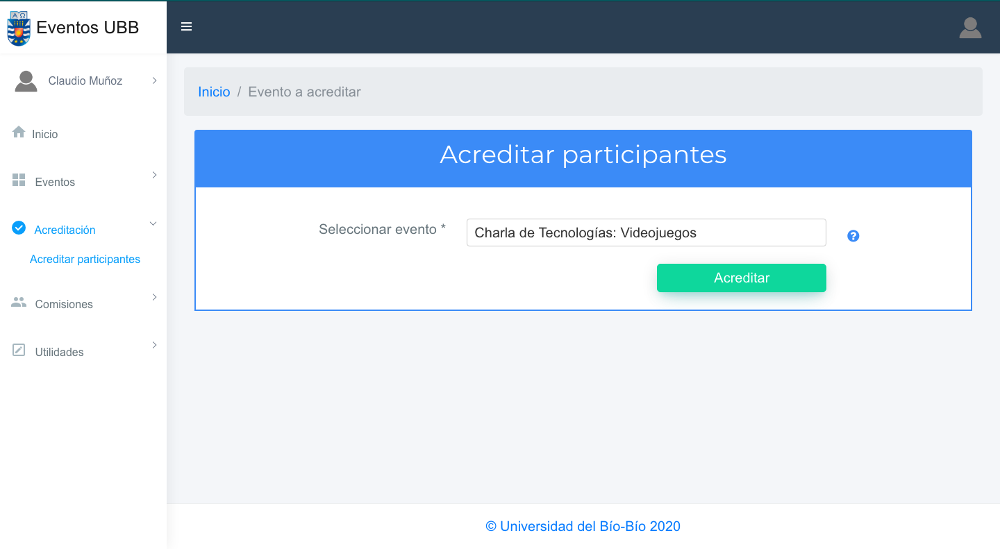
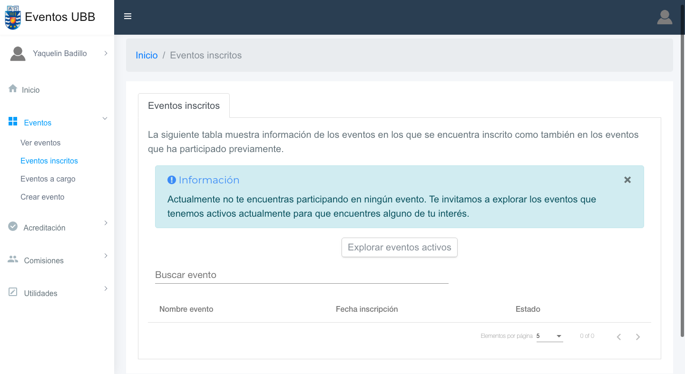
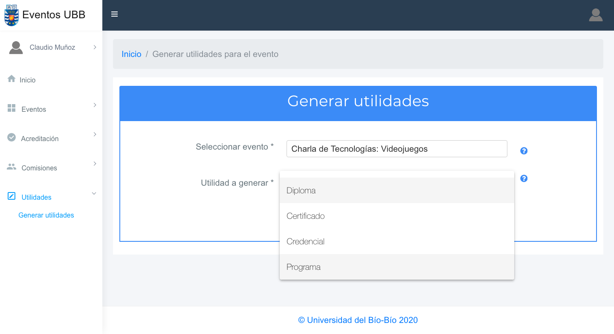
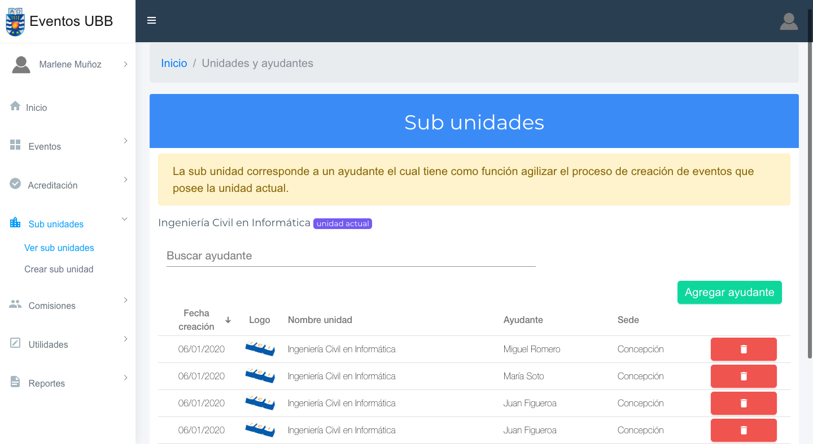

# Sistema de Eventos para la Universidad del Bío-Bío

La problemática que surge en torno a la realización de eventos comienza desde la organización de este, debido a que mucha información se maneja con distintas plataformas o en algunos casos, sin ninguna plataforma o medio digital, lo que provoca la pérdida de información relevante que produce un evento. Es por esto, que el objetivo de este proyecto es sistematizar la creación de eventos en la Universidad del Bío-Bío, esto quiere decir, que la organización y difusión se realice mediante el sistema, el cual permita crear y agregar toda la información asociada para mantener un registro detallado. También, permita la  inscripción  de  los  usuarios  en  el  mismo  sistema, con  el  fin  de  conocer  la  cantidad  de personas que participan y evitar que las personas se inscriban utilizando otros medios. En conclusión, el sistema va a almacenar toda la información respecto a los eventos que se realizan en  la  Universidad  del  Bío-Bío con  el  fin  de  generar  reportes  que  ayuden  a  la  futura  toma  de decisiones. Finalmente, para llevar a cabo el desarrollo de este proyecto se utiliza la metodología ágil Scrum, y también el  uso  de  nuevas tecnologías como el Framework Angular para desarrollar el Front-End.

## Estructura del proyecto

* **componentes** contiene todos los elementos que conforman la página.
* **login** contiene las vistas para el registro, inicio de sesión, confirmación de la cuenta y recuperación de la contraseña.
* **model** contiene las clases de la base de datos.
* **pipes** contiene las configuraciones para utilizar pipes en el proyecto.
* **servicios** contiene los servicios de cada clase o tabla de la base de datos, también contiene los guards, las alertas de tipo modal y un archivo **global.ts** que contiene la URL para la conexión local o con el servidor.
* **utilidades** contiene los componentes estáticos como el header, footer, entre otros.

## Capturas del proyecto

#### Inicio de sesión

#### Inicio

#### Administrar eventos

#### Detalles de un evento

#### Vista de los detalles del evento 

#### Acreditación de participantes

#### Ver eventos inscritos

#### Generar utilidades de un evento

#### Archivo PDF generado

#### Ver sub unidades

## License
[MIT](https://choosealicense.com/licenses/mit/)
